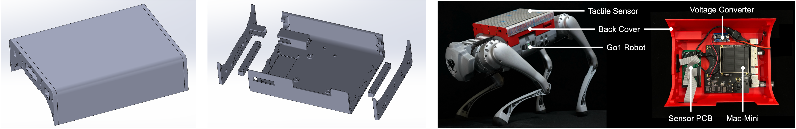

# Perceptive Learning for Legged Robots in IsaacLab

[](https://docs.omniverse.nvidia.com/isaacsim/latest/overview.html)
[](https://isaac-sim.github.io/IsaacLab)
[](https://docs.python.org/3/whatsnew/3.10.html)


### Table of Contents
1. [Overview](#overview)  
2. [Key Features](#key-features)
3. [Installation](#installation)  
4. [Training, Play, and Deployment](#training-play-and-deployment)
5. [Known Issues](#known-issues)
6. [FAQ](#faq)


## Overview
This repository provides code for training **perceptive** policies for legged robots using the **manager**-based workflow in **IsaacLab**.
Network architectures, distillation methods, and other configurations can be **easily customized** through parameters.
The learned policies can be tested with **MoCap** or deployed on an onboard **Mac Mini** computer.


## Key Features
- **[LocoTouch](https://arxiv.org/abs/2505.23175)** Implementations
  - [x] Quadrupedal Transport Policy with Tactile Sensing
    
  - [x] Adaptive Symmetric Locomotion Gait (via Symmetricity Reward Function)
    


- **Flexible Network Architectures** for RL/IL
  - [x] MLP Policy w/wo MLP/CNN Encoder, w/wo RNN Module
    
  - [ ] Transformer Policy
  - [ ] Diffusion Policy


- **Teacher-Student** Pipelines
  - [x] "[RMA](https://arxiv.org/pdf/2107.04034)" (Latent Supervision)
  - [x] "[Monolithic](https://arxiv.org/pdf/2211.07638)" (Action Supervision)
  <!--  -->
  - [ ] "[ROA](https://arxiv.org/pdf/2210.10044)" (Regularized Online Latent Supervision)

- **[Policy Deployment](https://github.com/linchangyi1/Go1-Policy-Deployment)**
  - [x] Signal Reading and Processing for Distributed Tactile Sensors
  - [x] MoCap-Robot Communication via NaNet and ROS
  - [x] IsaacLab-compatible depoyment code for Locomotion, State-Based Transport, and Tactile-Aware Transport polcies
  - [x] Mac Mini Setup with Custom-Designed Shell ([MacMini-for-Onboard-Robotics](https://github.com/linchangyi1/MacMini-for-Onboard-Robotics))
    


- **Evaluated Perception Modalities**
  - [x] Proprioception (Motor / IMU)
  - [x] Tactile Sensing
  - [ ] Visual Sensing (Depth / RGB)
  - [ ] Other Modalities (e.g., LiDAR)

Please note that the unimplemented features are not part of [LocoTouch](https://arxiv.org/abs/2505.23175), and there is no estimated timeline for their release.

## Installation

#### Install IsaacSim 4.20:
Download IsaacSim **4.20** from the **"Download Archive"** section on this [webpage](https://docs.isaacsim.omniverse.nvidia.com/4.5.0/installation/download.html).
Since there is no official guide for version 4.20, the following steps provide a working reference:

```bash
mkdir ~/isaacsim
cd ~/Downloads  # replace with your download folder
unzip "isaac-sim-standalone@4.2.0-rc.18+release.16044.3b2ed111.gl.linux-x86_64.release.zip" -d ~/isaacsim
cd ~/isaacsim
./omni.isaac.sim.post.install.sh
./isaac-sim.selector.sh
```

#### Install IsaacLab 1.40:
Clone the correct version of IsaacLab and check out the required commit:
```bash
git clone https://github.com/isaac-sim/IsaacLab.git
cd IsaacLab
git checkout ea766783996d57e9f60b6c58c739c5fa4fbe79c5  # Important!
```

Set up IsaacLab inside a Conda environment (or just following the [official instructions](https://isaac-sim.github.io/IsaacLab/v1.4.0/source/setup/installation/binaries_installation.html)).
```bash
ln -s ~/isaacsim _isaac_sim  # replace ~/isaacsim with your own IsaacSim folder
./isaaclab.sh --conda isaaclab
conda activate isaaclab
sudo apt install cmake build-essential
./isaaclab.sh --install
```

Verify your installation with a simple example:
```bash
python source/standalone/tutorials/00_sim/create_empty.py 
```

#### Install LocoTouch:
Using a python interpreter where IsaacLab is installed (such as the isaaclab conda environment above), install LocoTouch and Loco_RL:
```bash
cd LocoTouch
pip install -e .
cd loco_rl
pip install -e .
cd ..
```

Verify the installation by playing the teacher and student policies:
  - Teacher Policy:
    ```bash
    python locotouch/scripts/play.py --task Isaac-RandCylinderTransportTeacher-LocoTouch-Play-v1 --num_envs=20 --load_run=2025-09-01_21-03-58
    ```
  - Student Policy:
    ```bash
    python locotouch/scripts/distill.py --task Isaac-RandCylinderTransportStudent_SingleBinaryTac_CNNRNN_Mon-LocoTouch-Play-v1 --num_envs=20 --log_dir_distill=2025-09-02_23-27-14 --checkpoint_distill=model_7.pt
    ```


## Training, Play, and Deployment
#### Locomotion (Optional)
- RL Training:
  ```bash
  python locotouch/scripts/train.py --task Isaac-RandCylinderTransportTeacher-LocoTouch-v1 --num_envs=4096 --headless
  ```
- Play:
  ```bash
  python locotouch/scripts/play.py --task Isaac-Locomotion-LocoTouch-Play-v1 --num_envs=20
  ```
- Deployment:
  Follow the guide in [Go1-Policy-Deployment](https://github.com/linchangyi1/Go1-Policy-Deployment) for installation, and run:
  ```bash
  python teleoperation/joystick.py
  ```
  ```bash
  python deploy/locomotion.py
  ```

#### State-Based Object Transport (Teacher Policy)
- RL Training (recommend 15k+ iterations):
  ```bash
  python locotouch/scripts/train.py --task Isaac-RandCylinderTransportTeacher-LocoTouch-v1 --num_envs=4096 --headless
  ```
- Play:
  ```bash
  python locotouch/scripts/play.py --task Isaac-RandCylinderTransportTeacher-LocoTouch-Play-v1 --num_envs=20
  ```
- Deployment:
  Follow the guide in [Go1-Policy-Deployment](https://github.com/linchangyi1/Go1-Policy-Deployment) for installation, and run:
  ```bash
  python teleoperation/joystick.py
  ```
  ```bash
  python mocap/run_optitrack.py
  ```
  ```bash
  python deploy/transport_teacher.py
  ```
  
  


#### Tactile-Aware Object Transport (Student Policy)
- Distillation:
  ```bash
  python locotouch/scripts/distill.py --task Isaac-RandCylinderTransportStudent _SingleBinaryTac_CNNRNN_Mon-LocoTouch-v1 --training --num_envs=405
  ```

  Additional options are supported, e.g.:
  ```bash
  python locotouch/scripts/distill.py --task Isaac-RandCylinderTransportStudent _SingleBinaryTac_CNNRNN_Mon-LocoTouch-v1 --training --num_envs=405 --load_run=2025-09-01_21-03-58 --checkpoint=model_15000.pt --headless --distill_lr=0.0005
  ```

- Play (replace with your own log_dir_distill folder):
  ```bash
  python locotouch/scripts/distill.py --task Isaac-RandCylinderTransportStudent_SingleBinaryTac_CNNRNN_Mon-LocoTouch-Play-v1 --num_envs=20 --log_dir_distill=2025-09-02_23-27-14 --checkpoint_distill=model_7.pt
  ```
- Deployment:
  Follow the guide in [Go1-Policy-Deployment](https://github.com/linchangyi1/Go1-Policy-Deployment) for installation, and run:
  ```bash
  python teleoperation/joystick.py
  ```
  ```bash
  python tactile_sensing/run_tactile_sensing.py
  ```
  ```bash
  python deploy/transport_student.py
  ```
  
  


## Known Issues
- Python is not installed:
  ```bash
  conda install python=3.10
  ```
- Error occurs after running "./isaaclab.sh --install":
  ```bash
  pip install --upgrade pip
  ```
- Visualization error occurs after running "python source/standalone/tutorials/00_sim/create_empty.py":
  ```bash
  conda remove --force xorg-libxcb xorg-libx11 xorg-libxext libxcb libxkbcommon mesa-glu libglvnd
  ```


## FAQ
1. Why IsaacSim 4.20 and IsaacLab 1.40?
  - LocoTouch consists of a Go1 robot and an array-based tactile sensor (17*13 tactile units), which requires customizing the URDF and converting it to USD. When attempting to update to IsaacLab 2.0, we encountered a critical [issue](https://github.com/isaac-sim/IsaacLab/issues/1800) with URDF conversion. Although the Isaac team has committed to resolving this in a future version of the URDF importer, we have not yet tested the fix. For future projects, we plan to migrate to newer versions, and if stability is confirmed, we will consider to update this project accordingly.


## Reference
```bibtex
@article{lin2025locotouch,
  title={LocoTouch: Learning Dynamic Quadrupedal Transport with Tactile Sensing},
  author={Lin, Changyi and Song, Yuxin Ray and Huo, Boda and Yu, Mingyang and Wang, Yikai and Liu, Shiqi and Yang, Yuxiang and Yu, Wenhao and Zhang, Tingnan and Tan, Jie and others},
  journal={arXiv preprint arXiv:2505.23175},
  year={2025}
}
```
